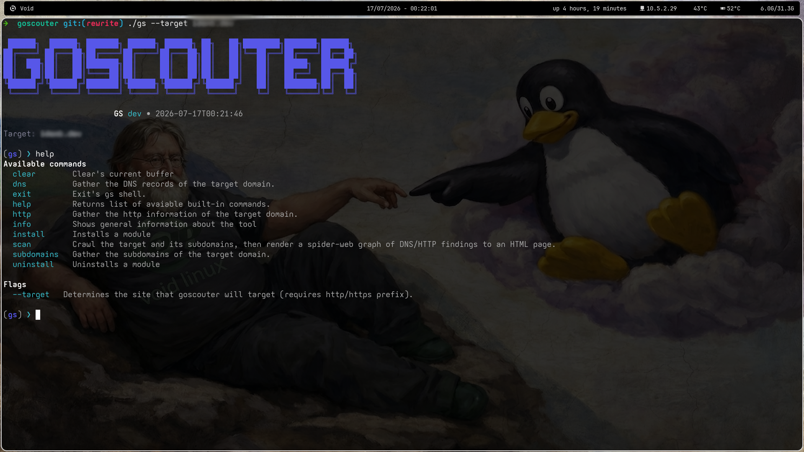

<p align="center">
  
</p>

<h1 align="center">GoScouter</h1>

<p align="center">
  A modular toolkit for scouting, probing, and analyzing networks.
</p>

<p align="center">
  Fast • Extensible • Cross-Platform
</p>

<p align="center">
  <a href="https://github.com/GoScouter/GoScouter/actions/workflows/build.yml">
    
  </a>
  <a href="https://github.com/GoScouter/GoScouter/releases">
    
  </a>
  <a href="https://github.com/GoScouter/GoScouter/blob/main/LICENSE.md">
    
  </a>
  <a href="https://goscouter.github.io">
    
  </a>
</p>

<p align="center">
  <a href="https://goscouter.github.io"><strong>Documentation</strong></a>
  ·
  <a href="https://github.com/GoScouter/GoScouter/releases"><strong>Downloads</strong></a>
  ·
  <a href="https://github.com/GoScouter/GoScouter/issues"><strong>Issues</strong></a>
</p>

---

## Overview

**GoScouter** is a modular toolkit for scouting, probing, and analyzing
networks. It bundles a collection of composable modules behind a single,
consistent command-line interface — so you can discover hosts, enumerate
services, and inspect network behavior without juggling a dozen separate
tools.

Built with a focus on speed and extensibility, GoScouter is designed to grow
with your workflow: enable only the modules you need, script it into your
pipelines, and extend it with your own probes.

> ⚠️ **Use responsibly.** GoScouter is intended for authorized security
> testing, research, and network administration only. Always ensure you have
> explicit permission to scan and probe the networks and hosts you target.

## Key Features

- **Modular architecture** — Each capability lives in its own module. Load
  what you need, skip what you don't.
- **Cross-platform** — First-class support for **macOS**, **Linux**, and
  **Windows**.
- **Extensible** — A clean plugin surface makes it straightforward to add
  your own probes and analyzers.
- **Unified CLI** — One consistent command-line interface across every
  module.
- **Analysis-ready output** — Human-readable by default, with
  machine-friendly formats for scripting and automation.

## Platform Support

| Platform | Supported | Notes                          |
| -------- | :-------: | ------------------------------ |
| Linux    |    ✅     | Primary development platform   |
| macOS    |    ✅     | Intel & Apple Silicon          |
| Windows  |    ✅     | Windows 10 / 11                 |

## Installation

> 📦 **Prebuilt releases are coming soon!**
> Precompiled binaries for macOS, Linux, and Windows will be published on the
> [Releases](https://github.com/GoScouter/GoScouter/releases) page. Until then,
> you can build GoScouter from source using the instructions below.

### Build from source

Building from source requires the [Go toolchain](https://go.dev/dl/)
(1.26 or newer), `make`, and `git`.

```bash
# Clone the repository
git clone https://github.com/GoScouter/GoScouter.git
cd GoScouter

# Build the binary (produces ./gs)
make build
```

`make build` compiles the project from `./cmd` and produces a `gs` binary in
the current directory. To cross-compile a release binary for a specific
platform, use the `release-build` target:

```bash
# Cross-compile for a specific OS/arch — output lands in dist/
make release-build GOOS=linux   GOARCH=amd64   # dist/gs-linux-amd64
make release-build GOOS=darwin  GOARCH=arm64   # dist/gs-darwin-arm64
make release-build GOOS=windows GOARCH=amd64   # dist/gs-windows-amd64.exe
```

### Other Makefile targets

| Target               | Description                                    |
| -------------------- | ---------------------------------------------- |
| `make build`         | Build the `gs` binary                          |
| `make run`           | Build and run directly via `go run`            |
| `make test`          | Run the test suite with the race detector      |
| `make fmt`           | Format the source with `go fmt`                |
| `make vet`           | Run `go vet`                                   |
| `make tidy`          | Tidy `go.mod` / `go.sum`                        |
| `make clean`         | Remove build artifacts                         |

## Usage

GoScouter runs as an interactive shell. Point it at a target with the
`--target` flag (the target **must** include an `http://` or `https://`
prefix), and GoScouter drops you into its prompt:

```bash
gs --target https://example.com
```

Once inside the shell, type `help` to list the available built-in commands:

### Example session

```bash
$ gs --target https://example.com
# ... banner ...
gs> help              # list built-in commands
gs> info              # show tool information
gs> install https://github.com/GoScouter/some-module
gs> exit              # leave the shell (or press Ctrl-D)
```



## Contributing

Contributions are welcome! Whether it's a bug report, a feature request, a new
module, or documentation improvements, we'd love your help.

- Found a bug or have an idea? [Open an issue](https://github.com/GoScouter/GoScouter/issues).
- Want to contribute code? Fork the repository, create a branch, and open a
  pull request.
